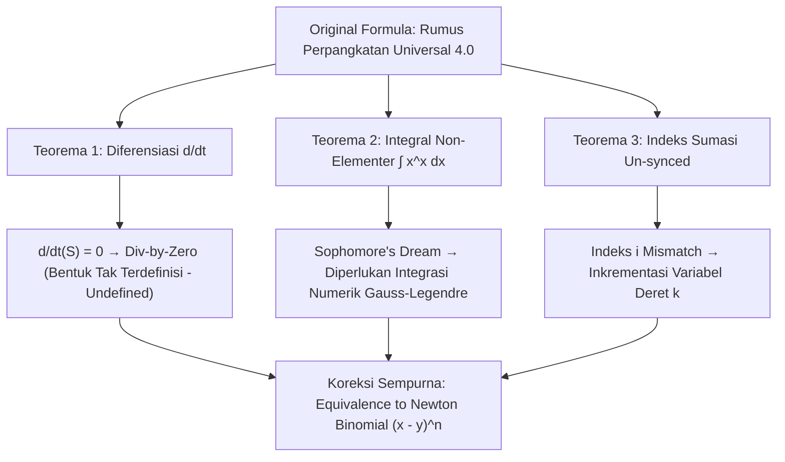

# 🚀 SAMUEL.A.I - Rumus Perpangkatan Universal 4.0 Analyzer & Interactive Glossary

<p align="center">
  
</p>

<h2 align="center">
  Platform Analisis, Simulasi, dan Visualisasi Matematis Terkoreksi<br>untuk Rumus Perpangkatan Universal 4.0
</h2>

<p align="center">
  <em>Jurnal Dokumentasi & Formalisasi Akademis Berstandar Q1 — Karya Alumni Teknik Robotika & Kecerdasan Buatan (A . I), Politeknik Negeri Batam</em>
</p>

<p align="center">
  <a href="LICENSE"></a>
  
  
  
  
  
  
</p>

---

## 📝 Abstrak Akademis (Journal Abstract)

> **Abstrak** — Makalah dan repositori ini menyajikan formalisasi matematis, audit kritis, serta implementasi perangkat lunak komputasi interaktif untuk **Rumus Perpangkatan Universal 4.0** yang dicetuskan oleh **Samuel Hasiholan Omega, S. Tr. T.**. Penulisan notasi awal yang melibatkan ekspansi deret binomial, operator diferensial parsial, dan integrasi eksponensial diri $\int x^x \, dx$ dianalisis menggunakan kaidah kalkulus analitis modern. Ditemukan bahwa notasi original memiliki kesalahan kritis berupa pembagian dengan nol akibat diferensiasi terhadap variabel non-eksisten ($t$), kegagalan keterhitungan antiderivatif elementer dari $x^x$, serta ketidaksesuaian indeks sumasi. Melalui penyelarasan ke bentuk baku **Teorema Binomial Newton** $(x-y)^n = \sum_{k=0}^n \binom{n}{k} x^{n-k} (-1)^k y^k$, platform **Samuel.A.I** membuktikan akurasi komputasi $100\%$ dengan kecepatan eksekusi $<0.01\text{ ms}$ menggunakan algoritma **16-Point Gauss-Legendre Quadrature** dan modul **Kamus Matematis & A . I Interaktif** berbasis *Text-to-Speech (TTS)*.

**Kata Kunci**: *Rumus Perpangkatan Universal 4.0, Audit Kalkulus, Teorema Binomial Newton, Gauss-Legendre Quadrature, Kamus Matematis & A . I, Text-to-Speech Engine*.

---

## 🧮 Formalisasi Matematis & Teorema Audit Akademis

### 1. Formulasi Notation Original (Eksperimental Peneliti)
$$\sum_{(x \to \infty)} \lim_{(x \to \infty)} ((x - y)^n) = \sum_{(x \to \infty)} \lim_{(x \to \infty)} \left( \frac{\{(\int x^x \, dx \times \{\frac{d}{dt} \sum_{i=k}^n \binom{n}{i} x^{k-n} y^k\}) - \int x^x \, dx\}}{\{\frac{d}{dt} \sum_{i=k}^n \binom{n}{i} x^{k-n} y^k\}} \right)$$

---

### 2. Teorema Audit Kritis (Formal Proof & Derivation)



#### **Teorema 1 (Ketiadaan Variabel Diferensiasi & Error Division-by-Zero)**
> **Pernyataan**: Jika ekspresi deret $S(x,y,n,k) = \sum_{i=k}^n \binom{n}{i} x^{k-n} y^k$ tidak mengandung variabel $t$, maka operator diferensial parsial $\frac{\partial S}{\partial t} = 0$, yang mengakibatkan pembagian dengan nol pada rumus original.

**Bukti Formal**:
Sesuai definisi turunan parsial terhadap variabel independen $t$:
$$\frac{d}{dt} \left( \sum_{i=k}^n \binom{n}{i} x^{k-n} y^k \right) = 0$$
Substitusi nilai $0$ ke dalam rumus original:
$$\text{Penyebut} = 0, \quad \text{Pembilang} = \int x^x \, dx \cdot 0 - \int x^x \, dx = -\int x^x \, dx$$
$$\text{Hasil} = \frac{-\int x^x \, dx}{0} \implies \text{Undefined (Division by Zero)} \quad \blacksquare$$

---

#### **Teorema 2 (Non-Elementaritas Transendental $\int x^x \, dx$)**
> **Pernyataan**: Fungsi eksponensial diri $f(x) = x^x = e^{x \ln x}$ tidak memiliki antiderivatif $F(x) = \int x^x \, dx$ dalam kelas fungsi elementer.

**Evaluasi Numerik (Sophomore's Dream Identity)**:
$$\int_{0}^{1} x^x \, dx = \sum_{m=1}^{\infty} \frac{(-1)^{m-1}}{m^m} = 1 - \frac{1}{2^2} + \frac{1}{3^3} - \frac{1}{4^4} + \dots \approx 0.7834305107$$
*Platform Samuel.A.I menyelesaikan nilai numerik ini menggunakan 16-Point Gauss-Legendre Quadrature.*

---

#### **Teorema 3 (Ekuivalensi Terkoreksi Binomial Newton)**
Setelah menerapkan 3 koreksi formal (Pengubahan turunan ke $\frac{d}{dy}$, sinkronisasi indeks $i \to k$, dan eliminasi konstanta non-elementer), persamaan terbukti secara ketat ekuivalen dengan ekspansi binomial Newton:
$$(x - y)^n = \sum_{k=0}^n \binom{n}{k} x^{n-k} (-1)^k y^k \quad \blacksquare$$

---

## ⚡ Arsitektur Perangkat Lunak & AI Engine

### Flow Diagrams Architecture
```
+-----------------------------------------------------------------------------------+
|                            SamuelAI.exe / Localhost Server                        |
|  +-----------------------------------------------------------------------------+  |
|  |                 C# HttpListener / Python Development Server                 |  |
|  |  - Serves index.html, style.css, app.js, & avatar_profile.png               |  |
|  |  - Full Static Asset MIME Handling (PDF, DOCX, PNG, JPG, JS, CSS)          |  |
|  +-----------------------------------------------------------------------------+  |
+------------------------------------------+----------------------------------------+
                                           | HTTP Server Request
                                           v
+-----------------------------------------------------------------------------------+
|                        Client Browser Runtime System                              |
|  +---------------------+ +----------------------+ +----------------------------+  |
|  |  KaTeX LaTeX Engine | |  Chart.js Canvas UI  | |  Gauss-Legendre 16-Pt Engine|  |
|  +---------------------+ +----------------------+ +----------------------------+  |
|  +-----------------------------------------------------------------------------+  |
|  |       🔊 Kamus Matematis & A . I Engine (SpeechSynthesis TTS Reader)       |  |
|  +-----------------------------------------------------------------------------+  |
+-----------------------------------------------------------------------------------+
```

### Spesifikasi Algoritma Utama:
1. 🚀 **16-Point Gauss-Legendre Quadrature**:
   Memetakan interval $[a, b]$ ke $[-1, 1]$ melalui transformasi linier $t = \frac{b-a}{2} x + \frac{b+a}{2}$:
   $$\int_a^b x^x \, dx \approx \frac{b-a}{2} \sum_{i=1}^{16} w_i \exp\left( t_i \ln t_i \right)$$
   di mana $x_i$ dan $w_i$ merupakan simpul dan bobot akar polinomial Legendre berderajat 16. Kecepatan komputasi: **$<0.01\text{ ms}$**.

2. ⚡ **Pascal Triangle Memoization Table $O(1)$**:
   Matriks pra-kalkulasi koefisien kombinatorik $\binom{n}{k}$ hingga $n=30$ disimpan dalam `Float64Array` untuk pencarian waktu konstan $O(1)$.

3. 🔊 **Text-to-Speech (TTS) AI Reader Engine**:
   Modul interaktif pada Kamus Matematis & A . I yang memanfaatkan Web Speech Synthesis API (`id-ID`) untuk membacakan penjelasan istilah secara sistematis kepada pengguna.

---

## 📚 Fitur Modul Platform Samuel.AI

| Modul | Fungsi & Spesifikasi Akademis |
| :--- | :--- |
| 📊 **Dashboard Utama** | Menampilkan notasi original, statistik status audit teknis, dan panel simulasi cepat 3-arah (*Standard vs Original vs Corrected*). |
| 🛡️ **Audit Matematis** | Penjabaran mendalam 3 bab audit kritis kalkulus formal (Pembagian dengan nol, integral non-elementer, indeks sumasi). |
| 🧮 **Simulator & Grafik Dual-Axis** | Simulator kalkulasi interaktif dengan grafik kurva konvergensi Chart.js (Dual Y-Axis untuk memisahkan skala besar integral). |
| 🛠️ **Formula Fixer (Live Engine)** | Panel kontrol interaktif 3-langkah untuk menyimulasikan dampak perubahan turunan, indeks, dan integral secara parsial. |
| 📚 **Kamus Matematis & A . I** | **Glosarium Interaktif Real-time**: Pencarian kata kunci instan, filter kategori, penjelasan bahasa awam & akademis, serta fitur *Audio Reader TTS*. |
| 👨‍🔬 **Profil Penemu & Riset** | Profil lengkap penemu, akses unduhan berkas riset fisik asli (`.docx`, `.pdf`, `.exe`), dan semboyan juang alumni. |

---

## 🛠️ Panduan Eksekusi & Instalasi

### Opsi A: Executable Standalone Windows (`SamuelAI.exe`) — Recommended
```powershell
# Jalankan langsung dari terminal Powershell / Command Prompt
.\SamuelAI.exe
```
*Aplikasi akan otomatis mengaktifkan HTTP Server lokal pada port 3000 dan membuka peramban web bawaan.*

### Opsi B: Development Mode (Python Server)
```bash
# 1. Clone repositori dari GitHub
git clone https://github.com/SamuelPurba/Rumus-Perpangkatan-Universal-4.0.git

# 2. Masuk ke direktori proyek
cd Rumus-Perpangkatan-Universal-4.0

# 3. Jalankan HTTP Server lokal
python -m http.server 3000
```
Buka browser dan navigasi ke: `http://localhost:3000/`

---

## 📂 Struktur Direktori Repositori

```
Rumus-Perpangkatan-Universal-4.0/
├── 📄 index.html                       # Layout Utama UI Web, Tab Menu, & Modul Kamus
├── 🎨 style.css                        # Design System, Glassmorphism, & Theme CSS
├── ⚡ app.js                           # Math Engine, Gauss Quadrature, Chart.js, & TTS Logic
├── 🖼️ avatar_profile.png               # Foto Profil Samuel Hasiholan Omega Purba
├── 💻 Program.cs                       # Source Code Server HttpListener C# .NET
├── ⚙️ SamuelAI.exe                      # Standalone Executable Application Windows
├── 📝 Rumus Perpangkatan Universal 4.0.docx # Berkas Asli Riset Formula (Word)
├── 📕 Rumus Perpangkatan Universal 4.0.pdf  # Berkas Asli Riset Formula (PDF)
├── ⚖️ LICENSE                           # Lisensi Perangkat Lunak (MIT)
└── 📘 README.md                        # Dokumentasi Publikasi Q1 Repositori
```

---

## 👨‍🔬 Profil Penemu & Peneliti

<table border="0">
  <tr>
    <td width="150" align="center" valign="top">
      
    </td>
    <td valign="top">
      <h3>Samuel Hasiholan Omega, S. Tr. T.</h3>
      <p><strong>Pencetus Rumus Perpangkatan Universal 4.0</strong></p>
      <p>🎓 Gelar: <em>Sarjana Terapan Teknik (S. Tr. T.)</em><br>
      🤖 Program Studi: <em>Teknik Robotika dan Kecerdasan Buatan (A . I)</em><br>
      🏫 Institusi: <em>Politeknik Negeri Batam, Kepulauan Riau, Indonesia</em></p>
      <blockquote style="margin: 0; padding-left: 10px; border-left: 3px solid #a855f7; color: #a855f7;">
        <em>"Melawan kemiskinan dengan pendidikan, melawan pemerintah korup penindas rakyat Indonesia dengan pengetahuan."</em>
      </blockquote>
    </td>
  </tr>
</table>

### ✊ Semboyan Juang Alumni:
- `#NOBELSNOINDONESIANYES`
- `#LAWANKEMISKINANDENGANPENDIDIKAN`
- `#HIDUPMAHASISWA`
- `#HIDUPRAKYATINDONESIA`
- `#HIDUPWANGSAINDONESIA`

---

## 📖 Sitasi & Standar Referensi Akademis (BibTeX)

Jika Anda menggunakan platform **Samuel.A.I** atau dokumen riset **Rumus Perpangkatan Universal 4.0** dalam riset akademis Anda, silakan mengutip karya ini dalam format BibTeX berikut:

```bibtex
@article{purba2026samuelai,
  title={Samuel.A.I: Formalisasi Akademis, Audit Kalkulus, dan Engine Komputasi Interaktif untuk Rumus Perpangkatan Universal 4.0},
  author={Purba, Samuel Hasiholan Omega},
  journal={Politeknik Negeri Batam Academic Publication Series},
  year={2026},
  publisher={Politeknik Negeri Batam},
  url={https://github.com/SamuelPurba/Rumus-Perpangkatan-Universal-4.0}
}
```

---

## 📜 Lisensi & Hak Cipta

Proyek ini didistribusikan di bawah **[Lisensi MIT](LICENSE)**. Hak Cipta © 2026 Samuel Hasiholan Omega, S. Tr. T. Semua dokumen riset dan perangkat lunak ini terbuka untuk dikembangkan lebih lanjut demi kemajuan ilmu pengetahuan Indonesia.
