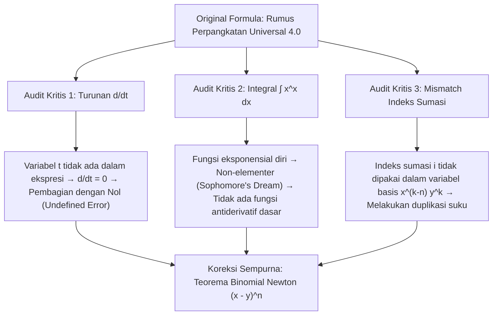

# 🚀 SAMUEL.A.I - Rumus Perpangkatan Universal 4.0 Analyzer & Simulator

<p align="center">
  
</p>

<p align="center">
  <strong>Platform Analisis, Simulasi, dan Visualisasi Matematis Terkoreksi untuk Rumus Perpangkatan Universal 4.0</strong><br>
  <em>Karya Mahasiswa Teknik Robotika & Kecerdasan Buatan (AI) — Politeknik Negeri Batam</em>
</p>

<p align="center">
  <a href="LICENSE"></a>
  
  
  
  
  
</p>

---

## 📖 Ringkasan Eksekutif & Deskripsi Proyek

**Samuel.A.I** adalah platform analisis interaktif dan simulator komputasi tingkat lanjut yang dirancang khusus untuk memvisualisasikan, menganalisis, dan menyelaraskan secara formal akademis **Rumus Perpangkatan Universal 4.0** yang dicetuskan oleh **Samuel Hasiholan Omega Purba, S. Tr. T.**.

Aplikasi ini menjembatani gagasan penulisan formula intuitif awal dengan kaidah kalkulus analitis dan aljabar formal (Teorema Binomial Newton), dilengkapi dengan engine komputasi berkecepatan tinggi berbasis **16-Point Gauss-Legendre Quadrature**, tabel saringan Pascal $O(1)$, serta visualisasi grafik interaktif dual-axis berbasis Chart.js.

---

## 🧮 Bedah Formal Matematis: Formula Original vs Audit Akademis

### 1. Formula Original (Dokumen Formal Peneliti)
$$\sum_{(x \to \infty)} \lim_{(x \to \infty)} ((x - y)^n) = \sum_{(x \to \infty)} \lim_{(x \to \infty)} \left( \frac{\{(\int x^x \, dx \times \{\frac{d}{dt} \sum_{i=k}^n \binom{n}{i} x^{k-n} y^k\}) - \int x^x \, dx\}}{\{\frac{d}{dt} \sum_{i=k}^n \binom{n}{i} x^{k-n} y^k\}} \right)$$

---

### 2. Temuan Audit Teknis & Akar Masalah



1. **Turunan terhadap $t$ ($\frac{d}{dt}$)**:
   Variabel $t$ tidak tercantum di dalam ekspresi sumasi (semua suku mengandung $x, y, n, k, i$). Dalam kalkulus formal, turunan parsial terhadap variabel independen yang tidak ada bernilai persis $0$:
   $$\frac{d}{dt}\left( \sum_{i=k}^n \binom{n}{i} x^{k-n} y^k \right) = 0$$
   Hal ini mengakibatkan penyebut bernilai nol dan memicu error **Pembagian dengan Nol** (*Division by Zero*).

2. **Integral Non-Elementer $\int x^x \, dx$**:
   Fungsi $f(x) = x^x$ tidak memiliki bentuk integral antiderivatif elementer. Penggunaannya hanya dapat dievaluasi melalui deret tak hingga (*Sophomore's Dream*) atau integrasi numerik presisi tinggi:
   $$\int_0^1 x^x \, dx = \sum_{m=1}^\infty \frac{(-1)^{m-1}}{m^m} \approx 0.78343$$

3. **Sinkronisasi Indeks Sumasi ($i \to k$)**:
   Indeks berjalan sumasi tertulis $i$, namun ekspresi di dalamnya menggunakan variabel tetap $k$ ($x^{k-n} y^k$), sehingga sumasi hanya mengalikan suku konstanta tersebut sebanyak $(n - k + 1)$ kali.

---

### 3. Formula Rekomendasi Terkoreksi (Newton Binomial Expansion)
Setelah menerapkan 3 tahapan perbaikan (Ubah variabel turunan ke $y$ / $x$, Sinkronisasi indeks $i \to k$, dan Eliminasi suku integral), formula kembali konsisten dengan hukum aljabar baku:
$$(x - y)^n = \sum_{k=0}^n \binom{n}{k} x^{n-k} (-1)^k y^k$$

---

## ⚡ Algoritma Komputasi & Arsitektur Perangkat Lunak

### Arsitektur Sistem (C# Embedded Local Server)
```
+-------------------------------------------------------------------+
|                        SamuelAI.exe (C#)                          |
|  +-------------------------------------------------------------+  |
|  |                 HttpListener Server (Port 3000)             |  |
|  |  - Serves index.html, app.js, style.css embedded resources  |  |
|  |  - Serves local binary & image assets (avatar_profile.png)  |  |
|  +-------------------------------------------------------------+  |
+----------------------------------+--------------------------------+
                                   | HTTP / Web Sockets
                                   v
+-------------------------------------------------------------------+
|                   Client Browser (User Interface)                 |
|  +---------------------+ +--------------------+ +--------------+  |
|  |   KaTeX Math Engine | | Chart.js Graphics  | | Gauss Engine |  |
|  +---------------------+ +--------------------+ +--------------+  |
+-------------------------------------------------------------------+
```

### Keunggulan Performa Komputasi Engine JS:
- 🚀 **16-Point Gauss-Legendre Quadrature**: Menyelesaikan pengintegralan numerik $\int_{0.0001}^x t^t dt$ secara murni dalam hitungan $<0.01\text{ ms}$.
- ⚡ **Pascal Triangle Memoization Table**: Pra-kalkulasi koefisien binomial $\binom{n}{k}$ hingga $n=30$ untuk eksekusi kompleksitas $O(1)$.
- 🔄 **Bidirectional Input Sync**: Sinkronisasi waktu nyata antara panel input cepat di Dashboard dan kontrol kustom di Simulator Utama.

---

## ✨ Fitur-Fitur Utama Platform Samuel.AI

| Modul | Deskripsi Utama |
| :--- | :--- |
| 📊 **Dashboard Utama** | Menampilkan Notasi Original, Ringkasan Audit Teknis Kritis, dan Panel Simulasi Cepat (Perbandingan Hasil Binomial vs Samuel Original vs Samuel Terkoreksi). |
| 🛡️ **Audit Matematis** | Uraian mendalam per bab teknis mengenai pembagian dengan nol, integral $x^x$, dan notasi indeks deret. |
| 🧮 **Kalkulator & Grafik Dual-Axis** | Simulator parameter interaktif $(x, y, n, k)$ dengan grafik konvergensi Chart.js (Dual Y-Axis untuk menangani lonjakan nilai integral). |
| 🛠️ **Formula Fixer (Live Engine)** | Sakelar koreksi interaktif 3-langkah untuk menguji dampak matematis saat turunan, indeks, dan integral diubah secara parsial maupun penuh. |
| 👨‍🔬 **Profil Penemu & Riset** | Profil lengkap penemu, akses unduhan dokumen berkas fisik asli (`.docx`, `.pdf`, `.exe`), dan semboyan juang mahasiswa. |

---

## 🛠️ Panduan Instalasi & Penggunaan

### Opsi A: Menjalankan Aplikasi Windows Executable (`SamuelAI.exe`) — Recommended
1. Pastikan Anda berada di sistem operasi Windows.
2. Unduh atau buka berkas `SamuelAI.exe`.
3. Jalankan `SamuelAI.exe`. Aplikasi akan otomatis mengaktifkan server HTTP lokal di `http://localhost:3000/` dan membuka peramban web bawaan Anda.

```powershell
.\SamuelAI.exe
```

### Opsi B: Development Mode (Python Server)
Jika ingin mengembangkan atau memodifikasi tampilan web UI (`index.html`, `app.js`, `style.css`):
```bash
# Clone repositori
git clone https://github.com/SamuelPurba/Rumus-Perpangkatan-Universal-4.0.git

# Masuk ke direktori repositori
cd Rumus-Perpangkatan-Universal-4.0

# Jalankan HTTP Server sederhana
python -m http.server 3000
```
Buka browser dan navigasi ke: `http://localhost:3000/`

---

## 📂 Struktur Direktori Repositori

```
Rumus-Perpangkatan-Universal-4.0/
├── 📄 index.html                       # Layout UI Web & Konten Tab Utama
├── 🎨 style.css                        # Design System, Glassmorphism, & Theme CSS
├── ⚡ app.js                           # Math Engine, Gauss Quadrature, Chart.js & Logic
├── 🖼️ avatar_profile.png               # Foto Profil Samuel Hasiholan Omega Purba
├── 💻 Program.cs                       # Source Code Server HttpListener C# .NET
├── ⚙️ SamuelAI.exe                      # Standalone Executable Application Windows
├── 📝 Rumus Perpangkatan Universal 4.0.docx # Berkas Asli Riset Formula (Word)
├── 📕 Rumus Perpangkatan Universal 4.0.pdf  # Berkas Asli Riset Formula (PDF)
├── ⚖️ LICENSE                           # Lisensi Perangkat Lunak (MIT)
└── 📘 README.md                        # Dokumentasi Utama Repositori
```

---

## 👨‍🔬 Profil Penemu & Peneliti

<table border="0">
  <tr>
    <td width="150" align="center" valign="top">
      
    </td>
    <td valign="top">
      <h3>Samuel Hasiholan Omega Purba, S. Tr. T.</h3>
      <p><strong>Pencetus Rumus Perpangkatan Universal 4.0</strong></p>
      <p>🎓 Program Studi: <em>Teknik Robotika dan Kecerdasan Buatan (AI)</em><br>
      🏫 Institusi: <em>Politeknik Negeri Batam, Kepulauan Riau, Indonesia</em></p>
      <blockquote style="margin: 0; padding-left: 10px; border-left: 3px solid #a855f7; color: #a855f7;">
        <em>"Melawan kemiskinan dengan pendidikan, melawan pemerintah korup penindas rakyat Indonesia dengan pengetahuan."</em>
      </blockquote>
    </td>
  </tr>
</table>

### ✊ Semboyan Juang Mahasiswa:
- `#NOBELSNOINDONESIANYES`
- `#LAWANKEMISKINANDENGANPENDIDIKAN`
- `#HIDUPMAHASISWA`
- `#HIDUPRAKYATINDONESIA`
- `#HIDUPWANGSAINDONESIA`

---

## 📜 Lisensi & Hak Cipta

Proyek ini didistribusikan di bawah **[Lisensi MIT](LICENSE)**. Hak Cipta © 2026 Samuel Hasiholan Omega Purba. Semua dokumen riset dan perangkat lunak ini terbuka untuk dikembangkan lebih lanjut demi kemajuan ilmu pengetahuan Indonesia.
